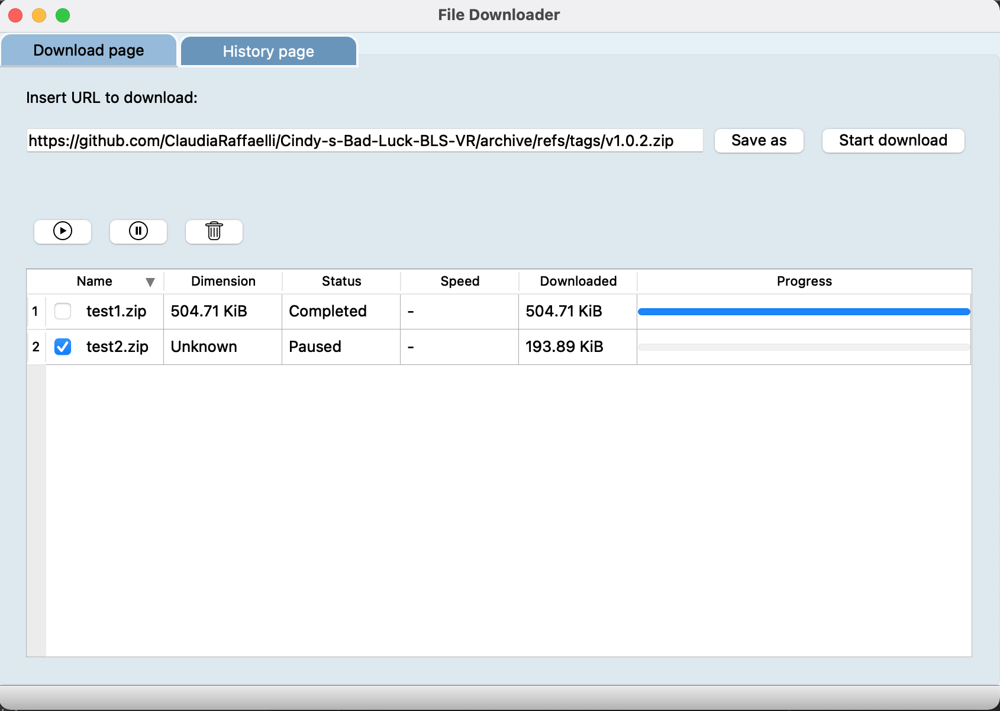
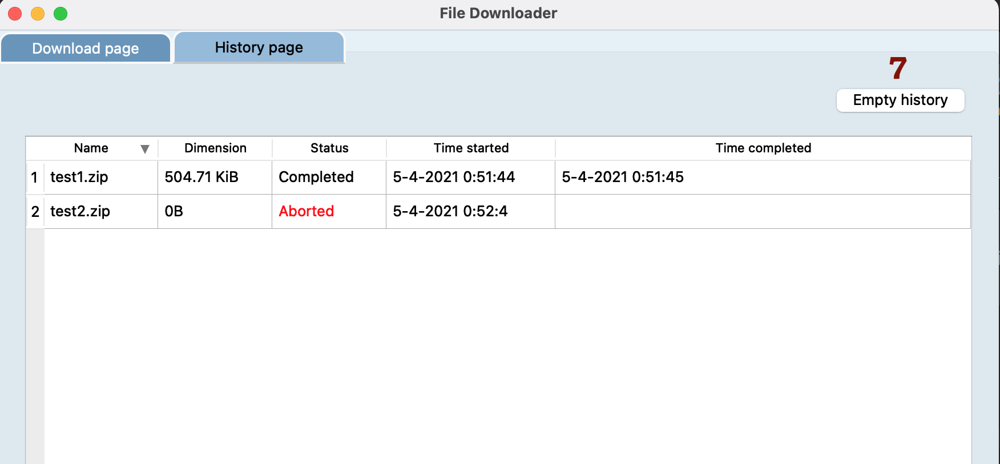

# FileDownloader

[](https://www.python.org/downloads/release/python-385/)

## Overview
FileDownloader is a download manager that allows the user to specify an URL and download the attached data. Multiple downloads can be started at the same time thanks to a multithreading approch. The downloads can be paused, re-started, aborted. Also the program maintains a history of completed and aborted downloads from a previous program run. The history is displayed in a different table and can be deleted by the user at any time.
If the program is closed all downloads are paused and can be resumed at the next program opening.

## How to run the program
To run the program it is recommended to install the following packages in a conda environment:

```
conda create -n yourCondaEnvName python=3.8.5
conda install pyqt=5.9.2
pip install requests
```

Always install the required dependencies when asked to. 

The program can then be run from the script ```main.py``` located in the ```gui``` folder.

## Detailed features
<p align="center">
    <i>Download page and History page:</i>
</p>
<p float="left" align="center">
  
   
</p>

Are here listed the main features of the program:
- To download a file must be inserted a valid URL in the input line (1). Through RegEx is instantly checked if the URL starts for ```https://``` or ```http://```. If this is not the case the URL is not accepted.
- Also if it is inserted an invalid URL the download won't start and the user will receive a feedback
- The user can either specify a filename for the download by pressing the button "Save As" (2), or can decide not to specify it. In this latter case the download will be set with a default name and saved in a Downloads directory.
- If there is an existing file with the same path as the chosen file the user will be asked to change the name of the download file.
- At this point a download can be started pressing Start Download (3). If there are no problems in the URL nor filename will be added a new row to the table. The download will automatically start.
- If the site which hosts the download data supports the header ```Content-Length```, then will be also available a progress bar and total download size (row number 1), otherwise this information will be set at the end of the download (row number 2).
- The downloads can be paused (5), re-started (4) and aborted (6). All this operations can be done at groups of checked rows.
- When hitting the abort button the user will be asked if it is sure of the decision. With Abort the files will be deleted from disk but still the download can be at any time re-started.
- The user can easily navigate to the location of the downloaded file with right click on a row of the table and pressing open from the menu.
- When the program is closed all the information on the downloads are stored in a JSON file that keeps track of the progress.
- When the program is opened again all the data is loaded inside the program. The Completed and Aborted downloads are moved to a different table inside the History Tab. All the other downloads are kept in the download page to be resumed when desired.
- If an un-completed download was moved from the saved position while the program was closed it won't be loaded at opening. On the contrary if the file is moved while the program is still open and it wasn't completed, it can be re-started. The download will start all over again since the already downloaded data is no more present.
- At the re-loading of the program the Completed and Aborted data are moved in the History table. If it is detected that this files are no longer available at the originally saved position, are marked as Moved. The user won't be able to "open in Finder" a download marked as Moved, option that will be disabled. If a completed / aborted file in the History table is moved while the program is open and the user tries to "open in Finder" the file will be updated as Moved and it also won't be possible to perform this action.
- The history of downloads can be erased at any time by the user by pressing the button (7). The user will be asked to confirm this choice.
- Also when the the program is closed the user must confirm this operation through a dialog. All downloads will be paused.

## Acknowledgments
Human Computer Interaction project - Computer Engineering Master Degree @[University of Florence](https://www.unifi.it/changelang-eng.html)
